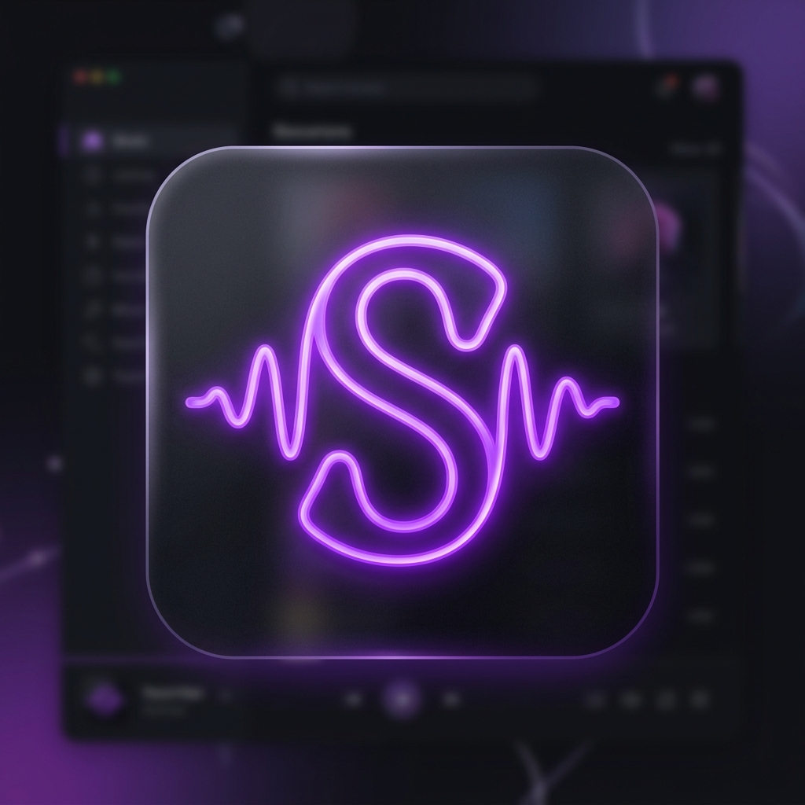

<div align="center">
  

  <h1>Sonoro Music</h1>

  <p><strong>A modern, modular Android music app and integrated Web streaming client with ad-free playback, synchronized lyrics, offline database support, and an on-device contextual AI recommendation engine.</strong></p>
</div>

---

## Overview

Sonoro Music delivers a seamless, premium listening experience by leveraging vast online music libraries—without any advertisements. It is fully modular, privacy-first, and features an integrated HTML5/JS Web Player companion client so you can stream music directly from your web browser.

---

## Features

### 📱 Android Application
* **Ad-Free Streaming**: Clean, ad-free streaming sourced from global databases.
* **Offline Caching**: Save metadata, favorites, and playlists locally using a Room SQL Database.
* **Sonoro Brain**: An on-device AI recommendation engine that learns your affinities, tracks queue skips, and injects tracks matching your context.
* **Synced Lyrics**: Parse line-by-line synchronized subtitles dynamically.
* **Music Recognition (Sonoro Find)**: Identify ambient audio around you using acoustic fingerprinting.
* **Material 3 UI**: Clean, dynamic colors extracted from the active album cover.

### 🌐 Companion Web Player Client
* **YouTube Music Search**: Query any song or artist in real-time from the browser.
* **Instant Background Stream**: Plays high-fidelity background audio using the YouTube IFrame API.
* **LrcLib Lyrics Integration**: Downloads and scrolls synchronized lyrics matching the playing song in real-time.
* **Personal Library**: Create custom playlists and save favorite tracks locally (persisted inside browser `localStorage`).
* **Glassmorphic Layout**: Dark theme visual design with smooth hover transitions.

---

## Technical Stack & Architecture

The project enforces **Clean Architecture** principles inside a multi-module gradle system:
* **UI**: Kotlin Jetpack Compose for declarative design.
* **Concurrency**: Kotlin Coroutines and asynchronous stateflows.
* **Playback Core**: Google Media3 (ExoPlayer) background service support.
* **Database**: Room DB for Android caching; HTML5 LocalStorage for Web Client data.
* **DI**: Dagger-Hilt for dependency injection.

---

## Running the Web Player Locally

To run the companion web player:
1. Open the [website/](website/) folder.
2. Serve the directory with a local HTTP server. For example:
   ```bash
   python -m http.server 8000
   ```
3. Open `http://localhost:8000` in your web browser.

---

## License

This project is shared for educational and college presentation purposes.
